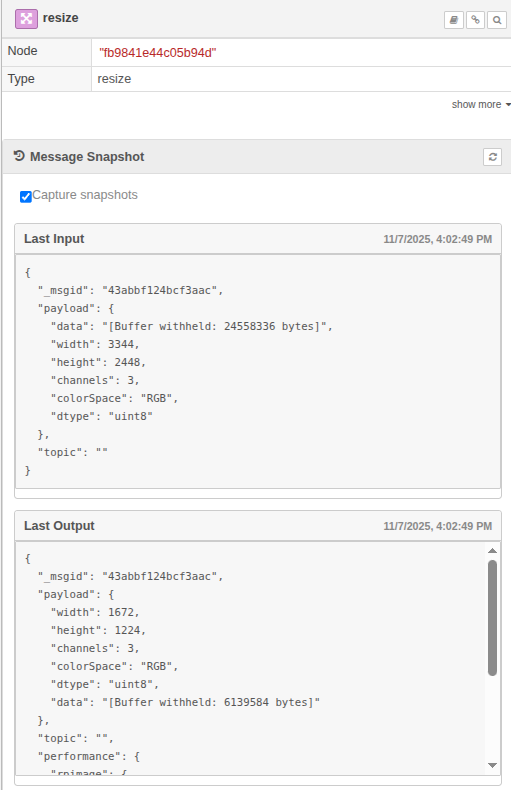

# @rosepetal/node-red-contrib-rosepetal-message-control

A Node-RED runtime plugin that remembers the last message each node received and sent. It gives you a live “what just happened?” snapshot without wiring extra debug nodes.



## Why you might want it
- **See data instantly**: select any runtime node in the editor and the latest inbound/outbound payloads appear in the Info sidebar.
- **Stay lightweight**: snapshots are automatically cleaned (buffers, long arrays, base64 blobs become annotated previews) so they are safe to ship to the editor.
- **Pause when needed**: a single toggle lets you stop capturing if you are chasing performance or privacy issues.
- **Script-friendly**: the same data is available over HTTP for tooling, tests, or dashboards.

## Quick start
1. Change into your Node-RED user directory (usually `~/.node-red`).
2. Install the plugin:
   ```bash
   npm install @rosepetal/node-red-contrib-rosepetal-message-control
   ```
3. Enable it inside `settings.js`:
   ```js
   plugins: {
     '@rosepetal/node-red-contrib-rosepetal-message-control': {
       enabled: true
     }
   }
   ```
4. Restart Node-RED.

Node-RED 3.0+ is required because the plugin relies on the `RED.hooks` runtime API.

## Using the snapshots in the editor
1. Open the *Info* sidebar.
2. Click any node on the canvas.
3. A **Message Snapshot** card appears with two sections:
   - *Last Input*: the most recent message the node received.
   - *Last Output*: the most recent message it sent.
4. Use the refresh button on the card to re-fetch without changing selection.

Snapshots use a clean format: large payloads are summarised, but every placeholder includes the original length so you can judge the size at a glance.

## Pausing/resuming capture
At the top of the Message Snapshot card you will find a **Capture snapshots** switch. Turning it off:
- Stops the runtime hooks from storing new payloads.
- Clears previously stored snapshots.
- Changes the card status to “Snapshots paused. Enable capture to resume.”

Turn it back on whenever you are ready—the view refreshes automatically for the currently selected node.

## Inspecting snapshots over HTTP
If you prefer to script or automate, the plugin exposes a small admin API that mirrors the sidebar data (list nodes, inspect a specific node, get/set the capture flag). Details and example payloads live in [`docs/http-api.md`](docs/http-api.md).

## How it works (at a glance)
- Hooks into `onReceive`/`onSend` via `RED.hooks` so every runtime node is observed without patching node prototypes.
- Stores the last inbound/outbound payload, node metadata, and timestamps in memory.
- Runs each payload through a clean-up pass (depth/length limits, typed-array summaries, buffer placeholders, base64/data URL detection, 256 KB cap) before exposing it.
- Serves the snapshot data to both the editor plugin (for the Info sidebar panel) and the admin HTTP endpoints.

## Limitations & notes
- Snapshots live only in memory. Restarting Node-RED or redeploying flows clears them.
- Payloads larger than 256 KB are truncated to a preview string.
- The HTTP routes require `flows.read` (GET) or `flows.write` (POST) permissions when admin authentication is enabled.
- Only runtime nodes that have processed a message since the plugin was enabled will appear.
